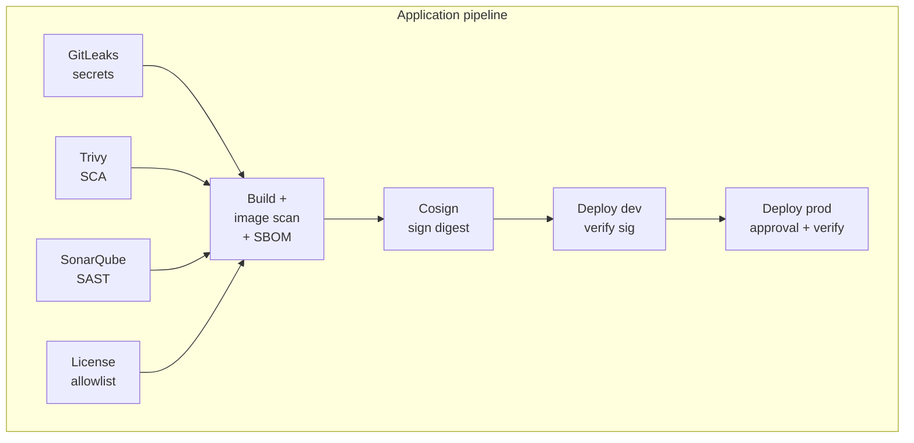
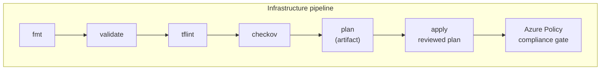

# azure-security-pipeline

A security-first CI/CD platform for Azure, built to demonstrate modern
DevSecOps end to end: every stage of delivery — infrastructure code,
application code, container images, and the deployment itself — passes
through an enforced security gate, and **no credential is stored anywhere in
the system**.

Azure DevOps · Terraform · Checkov · TFLint · Trivy · SonarQube · GitLeaks ·
Azure Key Vault · Azure Policy · Docker · AKS · Cosign

## The one-paragraph pitch

Two pipelines deliver a hardened AKS platform and a containerized workload.
Pull requests are validated with **zero cloud credentials**; merges to `main`
plan, build, scan, sign, and deploy through **OIDC-federated identities**
(no service-connection secrets), with images **signed keylessly on their
digest** and re-verified at the door of every environment. Human approvals
live on Azure DevOps Environments — outside the YAML they gate — and Azure
Policy enforces the same invariants at the platform for anything that tries
to sidestep the pipeline.

## Security gates at a glance





| Layer | Controls |
|---|---|
| **Infrastructure** | `terraform fmt`/`validate`, TFLint, Checkov (deny-by-default), Azure Policy deny assignments + post-deploy compliance gate, reviewed-plan-only applies |
| **Application** | GitLeaks (full history), Trivy SCA, SonarQube SAST with server-side quality gate, Trivy image scan + CycloneDX SBOM, license allowlist |
| **Deployment** | Environment approvals (requester ≠ approver), release gates, scoped RBAC, workload identity federation everywhere, Key Vault via CSI driver, Cosign keyless signing + verification |

## Repository layout

```
├── pipelines/
│   ├── infrastructure-pipeline.yml    # fmt → validate → lint → checkov → plan → apply → policy gate
│   ├── application-pipeline.yml       # 4 scan gates → build/scan → sign → deploy dev → deploy prod
│   └── templates/
│       ├── security/                  # one reusable template per security control
│       └── deploy/                    # cosign signing, verified AKS deploys
├── terraform/                         # AKS, ACR, Key Vault, network, identity, Azure Policy
│   ├── modules/                       # secure-by-default modules
│   └── environments/                  # dev / prod tfvars
├── app/                               # FastAPI sample workload + tests + hardened Dockerfile
├── kubernetes/                        # PSS-restricted namespace, hardened deployment,
│                                      # default-deny NetworkPolicy, Key Vault CSI
└── docs/                              # architecture, pipeline design, controls, threat model
```

## Documentation

| Document | Contents |
|---|---|
| [Architecture](docs/architecture.md) | Platform diagram, trust boundaries, identity & network model |
| [Pipeline design](docs/pipeline-design.md) | Stage-by-stage diagrams and the reasoning behind each gate |
| [Security control matrix](docs/security-controls.md) | Every control → implementation → threat mitigated, plus the RBAC table |
| [Threat model](docs/threat-model.md) | STRIDE analysis of the delivery platform, accepted risks |
| [Best practices](docs/best-practices.md) | The 12 DevSecOps principles this repo demonstrates |
| [Roadmap](docs/ROADMAP.md) | Phase history and post-v1 ideas |

## Highlights worth reading the code for

- **Zero stored credentials** — OIDC federation for the pipeline, workload
  identity for pods, managed identity for the kubelet, Entra-only AKS access
  (local accounts disabled), keyless signing. `grep -ri password` finds nothing.
- **What was reviewed is what runs** — Terraform applies the published plan
  artifact byte-for-byte; deploys verify the Cosign signature on the exact
  digest that was scanned.
- **Approvals a PR can't delete** — human gates live on Environment
  resources, not in the YAML they protect.
- **Suppressions are code-reviewed decisions** — every Checkov skip and
  GitLeaks allowlist entry carries a written justification in a tracked file.

## Deploying it yourself

1. Create the state backend (storage account, Entra-auth only) and an ADO
   service connection using **workload identity federation**.
2. Point the two pipelines at this repo; create Environments `platform-dev`,
   `app-dev`, `app-prod` and configure approvals/branch control as described
   in [pipeline design](docs/pipeline-design.md).
3. Set the variable values at the top of each pipeline (service connection
   name, ACR name, cluster/RG names) to match your subscription.
4. Run the infrastructure pipeline, then the application pipeline.

## License

MIT — see [LICENSE](LICENSE).
