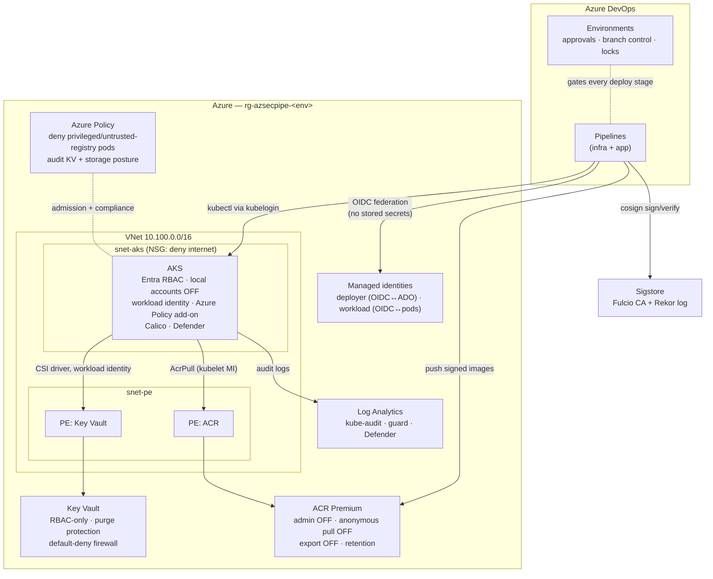

# Architecture

## Platform overview

## Trust boundaries

| Boundary | Crossing mechanism | Control |
|---|---|---|
| Developer → repo | git push / PR | Branch policies, GitLeaks full-history scan |
| Repo → pipeline | trigger | PR stage runs with **zero** cloud credentials |
| Pipeline → Azure | service connection | Workload identity federation (OIDC) — no client secret exists |
| Pipeline → registry | `az acr login` | Entra token, AcrPush scoped to the deployer identity |
| Registry → cluster | image pull | Kubelet managed identity (AcrPull); Azure Policy rejects other registries |
| Cluster → Key Vault | CSI driver | Pod workload identity, read-only role, private endpoint |
| Human → production | Environment approval | Separation of duties; requester ≠ approver |

## Identity model — no credential anywhere

Every arrow in the diagram above authenticates with a **federated, short-lived
token**. The platform stores no passwords, no client secrets, no signing
keys, and no kubeconfig with embedded certs:

- **Azure DevOps → Azure**: the service connection federates to
  `id-…-deployer` via OIDC (`terraform/modules/identity`).
- **Pods → Key Vault**: the app service account federates to
  `id-…-workload`, which holds only *Key Vault Secrets User*.
- **AKS → ACR**: the kubelet's managed identity holds *AcrPull*.
- **Humans → AKS**: Entra ID + `kubelogin`; Kubernetes local accounts are
  disabled at cluster creation.
- **Artifact signing**: Cosign keyless — ephemeral certificates from Fulcio,
  bound to the pipeline's OIDC identity, logged in Rekor.

## Network model

- PaaS data planes (Key Vault, ACR) sit behind **private endpoints** in a
  dedicated subnet; private DNS zones make FQDNs resolve to VNet addresses.
- The AKS subnet carries a **default-deny-inbound-from-internet** NSG.
- Inside the cluster, Calico enforces **default-deny NetworkPolicies** per
  namespace; the app's policy allows exactly DNS, HTTPS egress, and ingress
  from the ingress-controller namespace.
