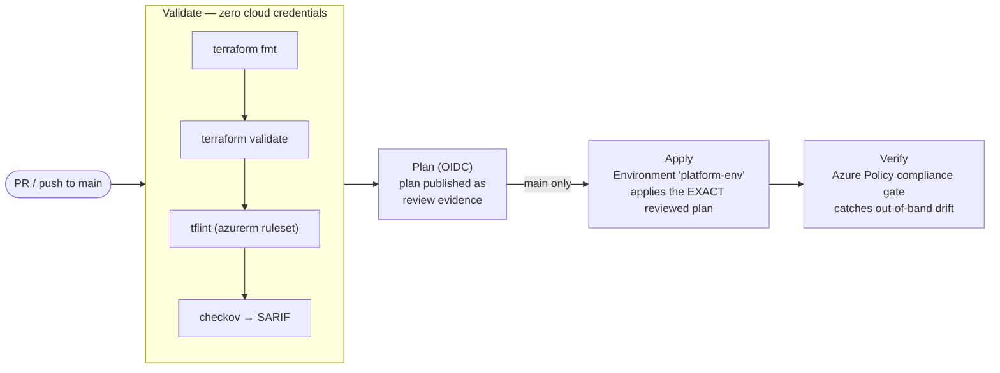

# Pipeline design

Two pipelines, one philosophy: **a stage is a security gate — nothing
promotes past a failed control.**

## Infrastructure pipeline (`pipelines/infrastructure-pipeline.yml`)

Key design decisions:

- **Validate needs no service connection.** Untrusted PR code runs static
  checks only; nothing it does can touch Azure.
- **Plan artifact hand-off.** Apply consumes the exact binary plan file that
  was produced, published, and reviewed — re-planning at apply time would
  create a time-of-check/time-of-use gap where the applied change differs
  from the approved one.
- **Verify runs after Apply.** Checkov predicts compliance from code; the
  Azure Policy gate measures the *deployed* estate, so changes made outside
  the pipeline are caught on the next run.

## Application pipeline (`pipelines/application-pipeline.yml`)

```mermaid
flowchart LR
    pr([PR / push to main]) --> S

    subgraph S["SecurityScan — 4 parallel gates"]
        direction TB
        gl["GitLeaks<br/>full-history secrets"]
        sca["Trivy SCA<br/>fixable HIGH/CRIT fail"]
        sq["SonarQube SAST<br/>server-side quality gate"]
        lic["License allowlist<br/>copyleft fails"]
    end

    S --> B["Build<br/>docker build → Trivy image scan + SBOM<br/>push (main only, OIDC)"]
    B -->|main only| G["Sign<br/>cosign keyless on the DIGEST<br/>Rekor transparency log"]
    G --> D["DeployDev<br/>Environment 'app-dev'<br/>verify signature → kubectl"]
    D --> P["DeployProd<br/>Environment 'app-prod'<br/>manual approval · business hours<br/>verify signature → kubectl"]
```

Key design decisions:

- **Parallel gates fail fast.** The four scan jobs are independent; a leaked
  secret doesn't wait for SonarQube to finish before failing the run.
- **Scan before push.** The image is scanned while it exists only on the
  build agent. A vulnerable image never reaches the registry, so there is no
  window in which it could be pulled.
- **Sign the digest, not the tag.** Tags are mutable pointers; the digest is
  the artifact. The signature is bound to the pipeline's OIDC identity via a
  Fulcio certificate and logged in Rekor — there is no signing key to manage.
- **Verification at the door of every environment.** Deploy stages refuse
  images whose signature doesn't verify back to this pipeline's identity;
  a manually pushed or tampered image cannot be promoted, even by an admin.
- **PR builds never publish.** Push, sign, and deploy stages are hard-gated
  on `refs/heads/main`, which itself is protected by branch policies.

## Where the human controls live

Approvals, branch control, business-hours windows, and exclusive locks are
attached to **Azure DevOps Environment resources** (`app-dev`, `app-prod`,
`platform-dev`), not written in pipeline YAML. This is deliberate: YAML is
editable by any PR — the approval requirement must not be removable by the
change it is meant to gate. Environment configuration is auditable and
requires administrator rights on the Environment resource.

| Environment | Checks configured |
|---|---|
| `platform-dev` | Approval (platform team) · branch control: `main` |
| `app-dev` | Branch control: `main` · exclusive lock |
| `app-prod` | Approval (service owners, requester ≠ approver) · branch control: `main` · business-hours window · exclusive lock |
